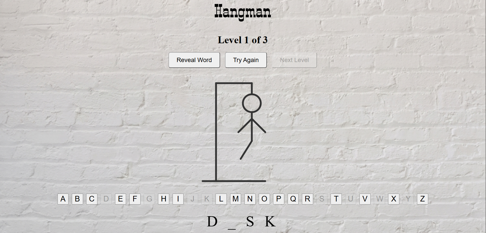

# Hangman Game 

🎮 How the Hangman Game Works
Hangman is a classic word-guessing game. The objective is to guess a hidden secret word, one letter at a time, before running out of allowed incorrect attempts.

Plaintext
  +---+
  |   |
  O   |   Word:  P Y T H _ N
 /|\  |   Guessed: A, E, I, O, P, T, Y
 /    |   Lives Left: 1/6
      |
========
🕹️ Game Rules
Word Selection: The game randomly picks a secret word from a pre-defined word list or dictionary.

Hidden Display: The player sees a row of underscores (_) representing each letter of the target word.

Guessing:

The player inputs one letter per turn.

Correct Guess: All occurrences of that letter are revealed in their correct positions.

Incorrect Guess: A part of the "hangman" is drawn (or a life/attempt is lost).

End Game Conditions:

Win: The player successfully guesses all the letters in the word before running out of lives.

Loss: The player runs out of allowed attempts (typically 6 strikes for head, body, two arms, and two legs) before revealing the word.

Assets Sources:
1.Gemini for the background image
2.Claude for the svg
3.Audio clip: [YouTube](https://www.youtube.com/watch?v=r6JK-gRELI0)

How to Play:
Pick letters until you complete the word. Make 6 mistakes and you will lose
The game has 3 levels, from easiest to most difficult

Tech used: JavaScript, HTML and CSS

To be added: hints for the guessed words

[Direct URL to the Game](https://munnerha.github.io/Hang-Man-Game-Project-Unit-1/)